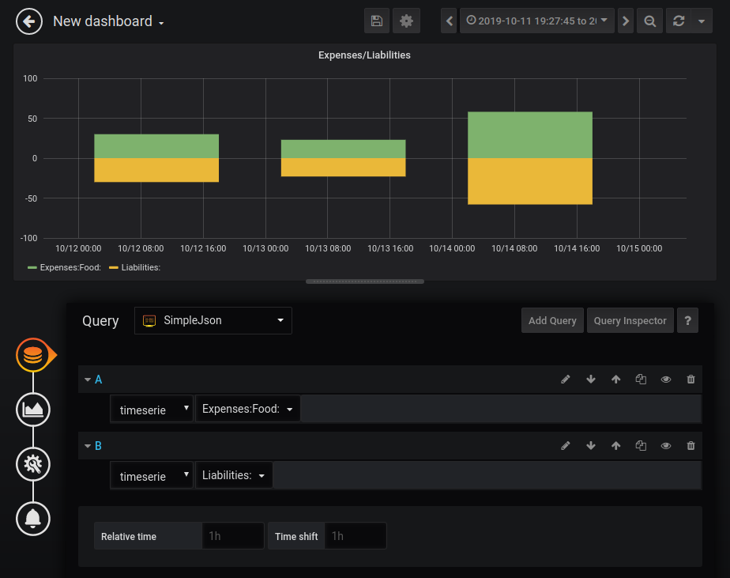

# grafana-ledger-data-source-server

Grafana JSON DataSource server for Ledger-cli.

This is a small Go backend server for using with Grafana's [SimpleJson](https://grafana.com/grafana/plugins/grafana-simple-json-datasource) DataSource plugin.

**Note**: There is a hacky PHP alternative [here](https://github.com/aquilax/grafana-ledger-data-source-php-server) which uses directly ledger-cli for data access.
**Note**: This is only a proof of concept project. Use it at your own risk.



## Try it out

### Running the server

Make sure you have [Go](https://golang.org/doc/install) installed.

Install the server:

```
go get github.com/aquilax/grafana-ledger-data-source-server
```

Now you can run the server like that:

```
grafana-ledger-data-source-server -f path/to/your/file.ledger
```

### Running Grafana

The easiest way to get started is by using the docker image for following [these instructions](https://grafana.com/docs/installation/docker/).

At the time of writing the command to run is:

```
docker run \
  -d \
  -p 3000:3000 \
  --name=grafana \
  -e "GF_INSTALL_PLUGINS=grafana-simple-json-datasource" \
  grafana/grafana
```

Note that the `GF_INSTALL_PLUGINS=grafana-simple-json-datasource` installs the [grafana-simple-json-datasource](https://github.com/grafana/simple-json-datasource) plugin.

After the command runs successfully, head to http://localhost:3000 and log in with `admin/admin`.


### Configuring the data source

* Go to http://localhost:3000/datasources and press `Add data source`.
* Select the `SimpleJSON` plugin from the list.
* Type `http://localhost:8080` in the URL field
* Select `Browser` in the Access field
* Press Save & Test

If the server is running, you should see a success message


### Creating a dashboard

* Create new dashboard and `Add Query`.
* From the Query dropdown select the `SimpleJSON` data source (for new installation it is also the default)
* From the query select `timeserie` (default)
* Start typing account name in the next field and select one in the dropdown
* You can add more queries to the same panel, or add as many panels as you need

## Accounts

Both exact account names and account groups can be used when query-ing the data. For example for the following ledger transaction:

```
2015/10/12 Exxon
    Expenses:Food:Lunch       10.00
    Expenses:Food:Dinner      20.00
    Liabilities:MasterCard
```

These are all available accounts to select from:

```
Liabilities:
Liabilities:MasterCard
Expenses:
Expenses:Food:
Expenses:Food:Dinner
Expenses:Food:Lunch
```

For the names that end on `:`, the data will be aggregated for all accounts that start with the selected prefix. For example the value for `Expenses:Food:` will be `30.00` for `2015/10/12`.


## Notes
* The transaction are currently read only when the server starts.
* The server uses the [howeyc/ledger](https://github.com/howeyc/ledger) package for parsing the ledger files and comes with all its limitations.
